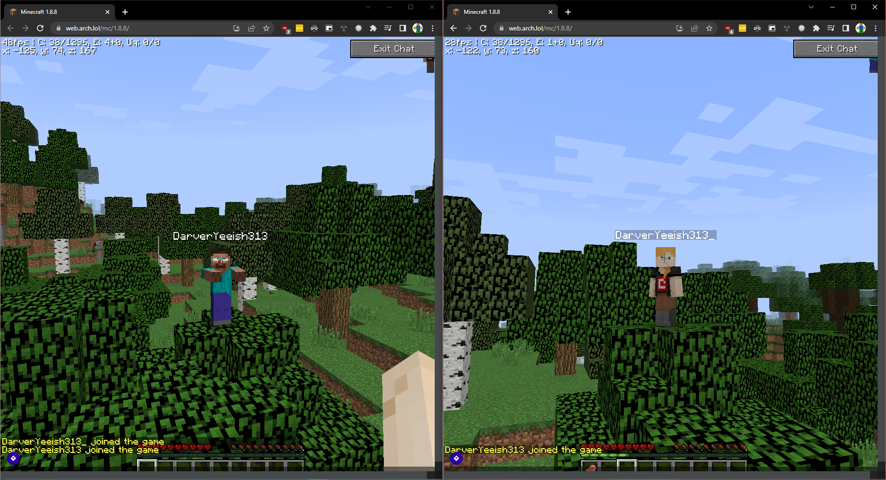

# EaglercraftX (1.8.9) WebSocket Proxy
### Demo: `wss://eaglerx-server.worldeditaxe.repl.co/server` ([EaglerX 1.8.9 client](https://web.arch.lol/mc/1.8.8/) only)

## What is this?
A WebSocket proxy that allows EaglercraftX 1.8 clients to connect to an offline vanilla Minecraft server with (mostly working) Eaglercraft skin support. This is meant to be a replacement for the unreleased official EaglercraftX bungee until it releases. It supports all offline 1.8.9 servers and even online servers when modified!  
**Note:** Don't expect magic. Some things may or may not work. While the proxy has shown to be stable and working during testing, you may encounter some bugs.
## Setup Guide
### Prerequisites
* Node.js v12 and up
* An **OFFLINE** 1.8.9-compatible Minecraft server or proxy
### Setup
#### If Repl.it is acceptable, fork the [demo](https://replit.com/@WorldEditAxe/eaglerx-server) and connect to it. All proxy files will be under the `proxy` folder.
1. Download the latest package available on this repository.
2. Open a terminal and go to the folder of the repository. Run `npm i`.
3. Edit `config.js` to configure your proxy. Below is a small breakdown of the configuration file.
```js
export const config = {
    // The name of the proxy. (unused, required for MOTD)
    name: "Proxy",
    // The address to bind the WebSocket server to.
    bindHost: "0.0.0.0",
    // The port to bind the WebSocket server to.
    // Use 80 if security.enabled is false, and 443 when it is true.
    bindPort: 80,
    // The max amount of concurrent connections allowed at once. (player cap)
    maxPlayers: 20,
    motd: {
        // The file path that leads to an image.
        // A 64x64 image is recommended, but any image with a 1:1 ratio will work.
        iconURL: "./icon.webp",
        // The first line of the MOTD.
        l1: "hi",
        // The second line of the MOTD. 
        l2: "lol"
    },
    server: {
        // The hostname/IP of the remote server you want the proxy to connect to.
        host: "127.0.0.1",
        // The port of the remote server you want the proxy to connect to.
        // On most Minecraft server installations, the default port is 25565.
        port: 25565
    },
    security: {
        // Set this to true to enable encryption (wss://).
        // If you're using Repl.it, there's no need to enable encryption as it comes by default on all repls.
        // You will need to obtain certificate files in order to enable encryption.
        enabled: false,
        // The private key file provided to you by your certificate authority.
        key: null,
        // The certificate file provided to you by your certificate authority.
        cert: null
    }
};
```
3. Start your proxy by running `node index.js`.
4. Connect to your server. For the server address, use the folllowing format: `ws://<IP>:<port>`. If you are using encryption, replace `ws://` with `wss://`.
## Creating Issues
When creating a new issue, please:
- Refrain from opening duplicate issues. If your issue is already there, please join in on the conversation there instead!
- Provide a brief description of the issue, what you expected, and what you got instead. Avoid unhelpful and overly short summaries - we need to know what's wrong!
